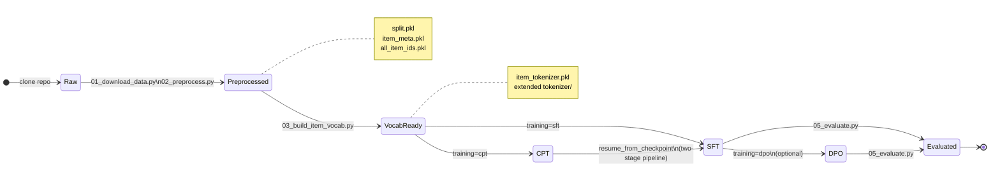
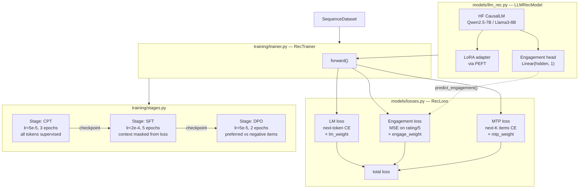
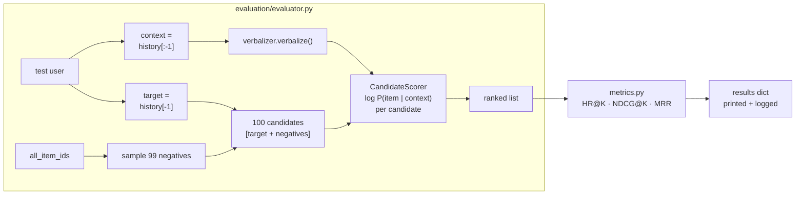
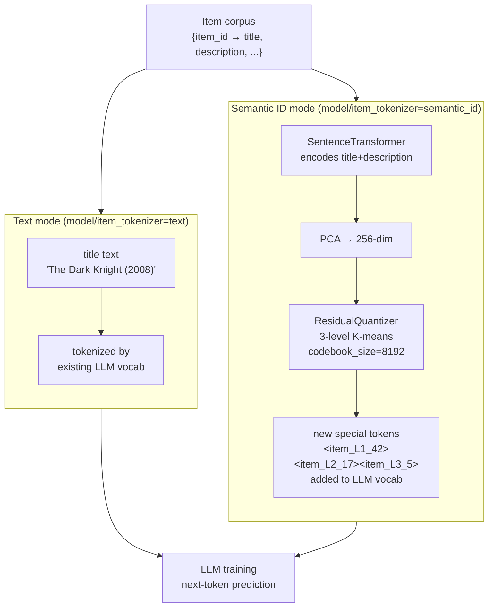

# Architecture

## Pipeline State Machine

Top-level states from raw data to evaluation results. Each transition is one script.

---

## Data Flow

How raw interactions become tokenized training examples.

```mermaid
flowchart TD
    subgraph Input["📂 Input"]
        ML["MovieLens\n.dat / .csv"]
        AMZ["Amazon Reviews\n.jsonl.gz"]
    end

    subgraph Datasets["data/datasets/"]
        ML --> MLD["MovieLensDataset.load()"]
        AMZ --> AMZD["AmazonReviewsDataset.load()"]
        MLD --> UH["UserHistory\n{user_id, item_ids,\nratings, timestamps,\nitem_metadata, extra}"]
        AMZD --> UH
    end

    subgraph Splits["data/splits.py"]
        UH --> SP["split_users()"]
        SP --> TR["train split"]
        SP --> VA["val split"]
        SP --> TE["test split"]
    end

    subgraph ItemTok["data/item_tokenizer/"]
        direction TB
        IT1["TextItemTokenizer\n'Toy Story (1995)'"]
        IT2["SemanticIDTokenizer\n&lt;item_L1_3&gt;&lt;item_L2_17&gt;&lt;item_L3_5&gt;"]
    end

    subgraph Verbalization["data/verbalization/"]
        TR --> VB
        VB["RatingHistoryVerbalizer\nor MinimalVerbalizer"]
        VB --> FM["InstructionFormatter\napply chat template\nmask input_len for SFT"]
    end

    FM --> COL["RecDataCollator\npad · truncate · label mask"]
    IT2 -.->|"extend vocab"| COL
    IT1 -.->|"no vocab change"| COL

    COL --> DS["SequenceDataset\n{full_text, input_len, rating}"]
```

---

## Model & Training

How the model is built and how losses are computed.

---

## Evaluation Flow

How a trained model is evaluated on the test split.

---

## Item Tokenization Strategies

